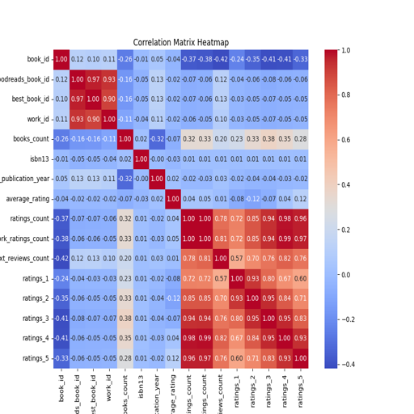
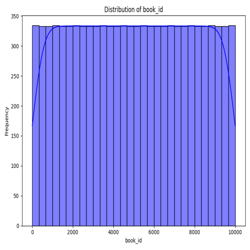
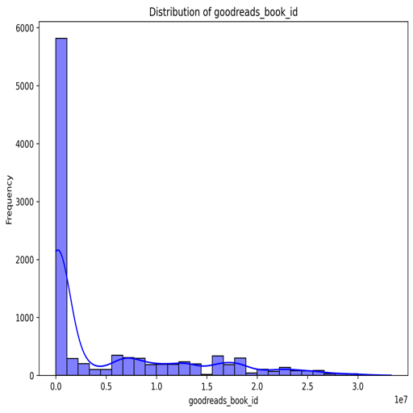
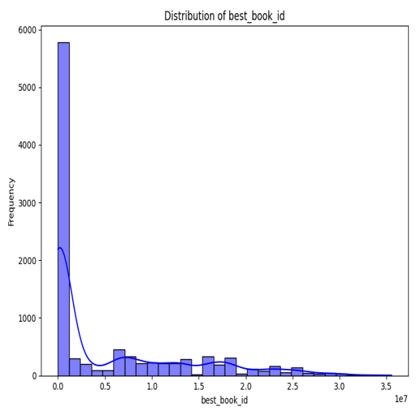
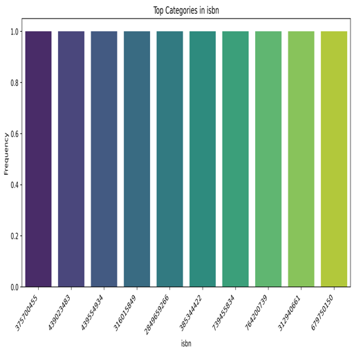
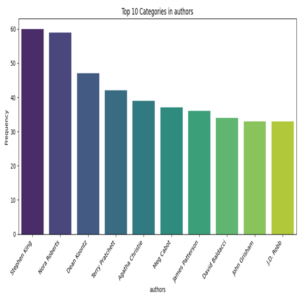
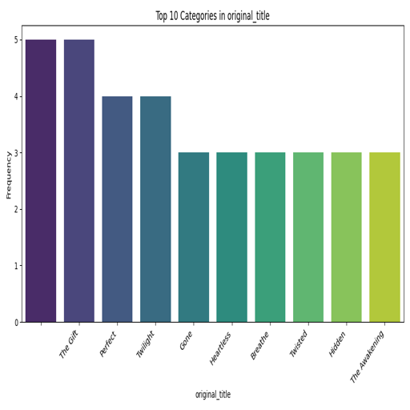
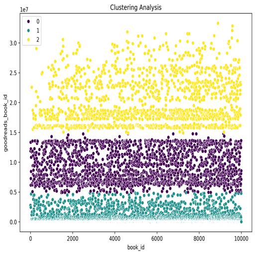
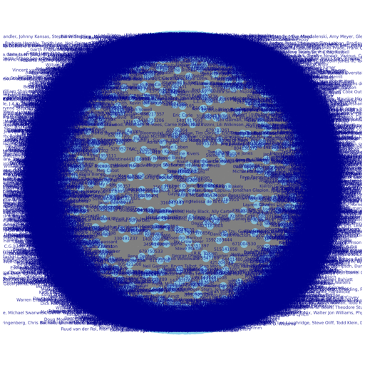

# Book Dataset Analysis Report

## Data Summary

This report provides an overview of a dataset consisting of books, presumably taken from a platform like Goodreads. The dataset contains features related to book attributes, ratings, and reviews.

### General Overview
- **Shape**: The dataset consists of **10,000 entries** (books) and **23 features** (attributes related to each book).

### Missing Values
Several attributes have missing values:
- **ISBN**: 700 missing
- **ISBN13**: 585 missing
- **Original Publication Year**: 21 missing
- **Original Title**: 585 missing
- **Language Code**: 1084 missing

Managing these missing values is crucial before conducting any analysis as they may introduce bias or errors in demographic or ratings analyses. Strategies for handling them could include removal, imputation, or treating them as a separate category depending on context.

### Data Types
The dataset includes varying data types:
- **Integer (`int64`)**: IDs, counts, and ratings (e.g., `book_id`, `ratings_count`).
- **Float (`float64`)**: Ratings, including `average_rating` and `isbn13`.
- **Object (`object`)**: String types (e.g., `authors`, `title`, `isbn`).

### Top 5 Entries
The head (first five records) reveals significant books that are likely well-known:
1. **"The Hunger Games"** by Suzanne Collins
2. **"Harry Potter and the Sorcerer's Stone"** by J.K. Rowling
3. **"Twilight"** by Stephenie Meyer
4. **"To Kill a Mockingbird"** by Harper Lee
5. **"The Great Gatsby"** by F. Scott Fitzgerald

Each entry includes URLs for images, facilitating visual representation for exploratory data analysis.

### Correlations
The correlation matrix reveals insights into relationships among features:
1. **Ratings and Reviews**: A strong positive correlation between `ratings_count` and `work_ratings_count` (0.995) indicates that books with more ratings also receive more work ratings. Likewise, ratings categories show strong positive inter-correlations.
2. **Books Count vs. Ratings**: A slight negative correlation between `books_count` and `average_rating` (-0.069) suggests books with higher counts might receive lower average ratings, or vice versa.
3. **Missingness and Data Integrity**: Relationships suggest that missing values could affect certain computations, emphasizing the need for appropriate handling.

## Actionable Insights
1. **Data Cleaning**: Address missing values through imputation or removal as necessary.
2. **Exploratory Analysis**: Analyze trends in ratings according to genres, authors, and publication years.
3. **Visualizations**: Create visual representations (e.g., histograms, scatter plots) to illustrate the correlations between ratings and reviews.
4. **Advanced Analysis**: Consider techniques such as clustering based on user ratings to identify potential marketing demographics.

## Conclusion
This dataset provides a comprehensive resource for analyzing book performance and reception. With appropriate preprocessing, it can yield valuable insights into reading trends, author popularity, and the relationship between ratings and book attributes. Engagement with this data could enhance understanding of both historical and contemporary literary landscapes.

## Visualizations
The following visualizations illustrate various aspects of the dataset:

