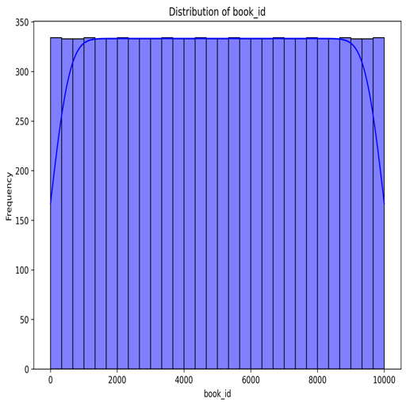
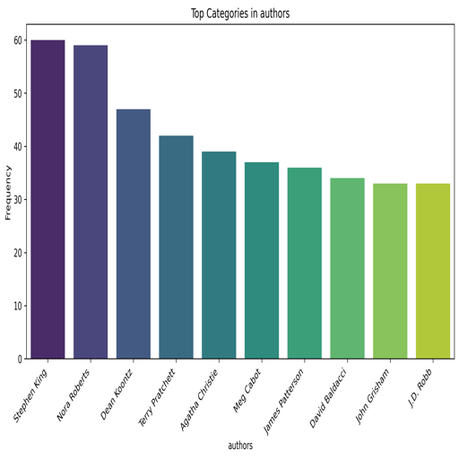

# Book Dataset Report

## Data Summary
The dataset provides a comprehensive overview of a collection of books with various attributes related to their metadata, ratings, authorship, and publication details.

### Overview
- **Dataset Shape**: (10,000 rows, 23 columns)

### Missing Values
- The dataset contains missing values in several columns:
  - `isbn`: 700 missing values
  - `isbn13`: 585 missing values
  - `original_publication_year`: 21 missing values
  - `original_title`: 585 missing values
  - `language_code`: 1,084 missing values
- Key identifiers such as `book_id`, `goodreads_book_id`, and `authors` have no missing values.

### Data Types
- The dataset features a mix of data types:
  - **Integer (`int64`)**: For identifiers and counts (e.g., `book_id`, `books_count`, `ratings_count`).
  - **Float (`float64`)**: Numeric values for average ratings and publication years (e.g., `average_rating`, `isbn13`).
  - **Object (`object`)**: Text fields such as `isbn`, `authors`, `original_title`, `title`, and URLs.

### Initial Records
The first five records of the dataset showcase well-known titles:

| Book ID | Goodreads Book ID | Best Book ID | Work ID  | Books Count | ISBN        | ISBN13              | Authors                                | Original Publication Year | Original Title                                              | Title                                                               | Language Code | Average Rating | Ratings Count | Work Ratings Count | Work Text Reviews Count | Ratings 1 | Ratings 2 | Ratings 3 | Ratings 4 | Ratings 5 | Image URL                                           | Small Image URL                                     |
|---------|-------------------|--------------|----------|-------------|-------------|---------------------|----------------------------------------|--------------------------|-----------------------------------------------------------|---------------------------------------------------------------------|---------------|----------------|----------------|---------------------|-------------------------|------------|------------|------------|------------|------------|------------------------------------------------------|-----------------------------------------------------|
| 1       | 2767052           | 2767052      | 2792775  | 272         | 439023483   | 9780439023480.0     | Suzanne Collins                        | 2008.0                   | The Hunger Games                                          | The Hunger Games (The Hunger Games, #1)                             | eng           | 4.34           | 4780653        | 4942365             | 155254                 | 66715      | 127936     | 560092     | 1481305    | 2706317    | [Image](https://images.gr-assets.com/books/1447303603m/2767052.jpg) | [Small Image](https://images.gr-assets.com/books/1447303603s/2767052.jpg) |
| 2       | 3                 | 3            | 4640799  | 491         | 439554934   | 9780439554930.0     | J.K. Rowling, Mary GrandPré           | 1997.0                   | Harry Potter and the Philosopher's Stone                 | Harry Potter and the Sorcerer's Stone (Harry Potter, #1)            | eng           | 4.44           | 4602479        | 4800065             | 75867                  | 75504      | 101676     | 455024     | 1156318    | 3011543    | [Image](https://images.gr-assets.com/books/1474154022m/3.jpg)             | [Small Image](https://images.gr-assets.com/books/1474154022s/3.jpg) |
| 3       | 41865             | 41865        | 3212258  | 226         | 316015849   | 9780316015840.0     | Stephenie Meyer                        | 2005.0                   | Twilight                                                 | Twilight (Twilight, #1)                                          | en-US         | 3.57           | 3866839        | 3916824             | 95009                  | 456191     | 436802     | 793319     | 875073     | 1355439    | [Image](https://images.gr-assets.com/books/1361039443m/41865.jpg)      | [Small Image](https://images.gr-assets.com/books/1361039443s/41865.jpg) |
| 4       | 2657              | 2657         | 3275794  | 487         | 61120081    | 9780061120080.0     | Harper Lee                             | 1960.0                   | To Kill a Mockingbird                                   | To Kill a Mockingbird                                           | eng           | 4.25           | 3198671        | 3340896             | 72586                  | 60427      | 117415     | 446835     | 1001952    | 1714267    | [Image](https://images.gr-assets.com/books/1361975680m/2657.jpg)       | [Small Image](https://images.gr-assets.com/books/1361975680s/2657.jpg) |
| 5       | 4671              | 4671         | 245494   | 1356        | 743273567   | 9780743273560.0     | F. Scott Fitzgerald                    | 1925.0                   | The Great Gatsby                                        | The Great Gatsby                                                | eng           | 3.89           | 2683664        | 2773745             | 51992                  | 86236      | 197621     | 606158     | 936012     | 947718     | [Image](https://images.gr-assets.com/books/1490528560m/4671.jpg)       | [Small Image](https://images.gr-assets.com/books/1490528560s/4671.jpg) |

### Correlation Analysis
The correlation matrix reveals relationships between various attributes. Here are some key insights:

- **Ratings Correlations**: 
  - Strong positive correlations exist between `ratings_count`, `work_ratings_count`, and individual rating categories (`ratings_1` to `ratings_5`), indicating that books with higher total ratings also receive more ratings across categories.
  - There are negative correlations between `average_rating` and various counts, suggesting a complex relationship where highly rated books may not be the most frequently rated.

- **Publication Year Insights**: 
  - The `original_publication_year` has a weak correlation with `average_rating`, implying that newer books do not necessarily have better ratings compared to older titles.

### Additional Insights
- **High Ratings Count**: The dataset features titles with high ratings and engagement, suggesting it includes popular books, notably from prominent authors.
- **Language Representation**: The dataset contains a significant number of missing values in the `language_code` field, indicating a potential gap in linguistic diversity.

### Conclusion
This dataset is well-suited for analyses focused on trends in popular literature, author performance, and reader engagement. Suggested analyses include exploring the impact of publication years on ratings and examining the relationship between rating counts and average ratings. Attention should be given to addressing missing values to enhance the dataset's usability for deeper analyses.

#### Visualizations
Here are some additional charts to visualize various aspects of the dataset:

