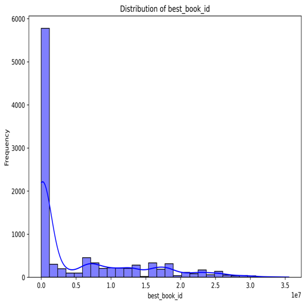
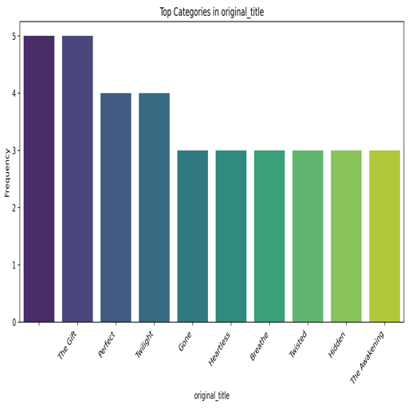

# Book Dataset Analysis Report

## Data Summary

The dataset consists of a collection of book-related data with the following characteristics:

- **Shape:** (10,000 rows, 23 columns)
  
### Missing Values
The dataset reveals several attributes with missing values:

- `isbn`: 700 missing entries
- `isbn13`: 585 missing entries
- `original_publication_year`: 21 missing entries
- `original_title`: 585 missing entries
- `language_code`: 1,084 missing entries

All other attributes are complete, indicating that there are no missing values for them. This suggests potential inconsistencies in the recording of `isbn` and `isbn13`.

### Data Types
The data types of the features provide insight into their nature:

- **Integer/Float Types:**
  - `int64`: Used for identifiers, counts, and ratings.
  - `float64`: Used for `isbn13` and `average_rating`.

- **Object Types:**
  - Attributes like `isbn`, `authors`, `original_title`, and `language_code` are string-based, indicating the need for string manipulation or categorical encoding in analyses or machine learning.

### Sample Data
Here are the first five entries from the dataset:

| book_id | goodreads_book_id | best_book_id | work_id  | books_count | isbn        | isbn13         | authors                             | original_publication_year | original_title                                         | title                                                        | language_code | average_rating | ratings_count | work_ratings_count | work_text_reviews_count | ratings_1 | ratings_2 | ratings_3 | ratings_4 | ratings_5 | image_url                                               | small_image_url                                           |
|---------|-------------------|---------------|----------|-------------|-------------|----------------|-------------------------------------|---------------------------|--------------------------------------------------------|------------------------------------------------------------|---------------|----------------|----------------|---------------------|--------------------------|-----------|-----------|-----------|-----------|-----------|---------------------------------------------------------|---------------------------------------------------------|
| 1       | 2767052           | 2767052       | 2792775  | 272         | 439023483   | 9780439023480  | Suzanne Collins                    | 2008                      | The Hunger Games                                       | The Hunger Games (The Hunger Games, #1)                    | eng           | 4.34           | 4780653       | 4942365             | 155254                   | 66715     | 127936    | 560092    | 1481305   | 2706317   |  |  |
| 2       | 3                 | 3             | 4640799  | 491         | 439554934   | 9780439554930  | J.K. Rowling, Mary GrandPré       | 1997                      | Harry Potter and the Philosopher's Stone               | Harry Potter and the Sorcerer's Stone (Harry Potter, #1) | eng           | 4.44           | 4602479       | 4800065             | 75867                    | 75504     | 101676    | 455024    | 1156318   | 3011543   |      |      |
| 3       | 41865             | 41865         | 3212258  | 226         | 316015849   | 9780316015840  | Stephenie Meyer                   | 2005                      | Twilight                                               | Twilight (Twilight, #1)                                    | en-US         | 3.57           | 3866839       | 3916824             | 95009                    | 456191    | 436802    | 793319    | 875073    | 1355439   |   |   |
| 4       | 2657              | 2657          | 3275794  | 487         | 61120081    | 9780061120080  | Harper Lee                          | 1960                      | To Kill a Mockingbird                                 | To Kill a Mockingbird                                      | eng           | 4.25           | 3198671       | 3340896             | 72586                    | 60427     | 117415    | 446835    | 1001952   | 1714267   |      |      |
| 5       | 4671              | 4671          | 245494   | 1356        | 743273567   | 9780743273560  | F. Scott Fitzgerald                | 1925                      | The Great Gatsby                                        | The Great Gatsby                                           | eng           | 3.89           | 2683664       | 2773745             | 51992                    | 86236     | 197621    | 606158    | 936012    | 947718    |      |      |

### Correlations
The correlation matrix gives insights into how certain attributes relate to one another. Here are some notable observations:

- **Strong Negative Correlation:**
  - `ratings_count` and `work_ratings_count` show considerable negative correlations with `books_count` and various ratings categories (e.g., `ratings_1`, `ratings_2`).

- **Strong Positive Correlation:**
  - `ratings_count` and `work_ratings_count` are nearly perfectly correlated (0.995), suggesting that books with higher ratings tend to receive more reviews.

- **Independence with ISBN:**
  - Attributes `isbn` and `isbn13` exhibit weak correlations, indicating that ISBN numbers do not significantly relate to a book's ratings or counts.

## Insights

This dataset summary presents valuable insights into the characteristics and structure of the dataset, which can drive future analyses and predictions.

### Observations

1. **Popularity Indicators:**
   - Features such as `ratings_count`, `average_rating`, and `work_ratings_count` are critical for understanding a book's reception.
   - The attributes related to rating counts could help develop models to predict a book's future popularity based on historical data usage.

2. **Data Quality & Preparation:**
   - The presence of missing values (especially in `isbn` and `language_code`) will require attention during preprocessing. Adjustments can involve imputation methods or the exclusion of non-essential entries based on analysis goals.

3. **Potential for Further Analysis:**
   - The dataset allows for various analytics, such as exploring trends over publication years or identifying authors with consistently high ratings.
   - Cluster analysis could segment authors or genres based on ratings to identify patterns or niche markets.

4. **Visualization Opportunities:**
   - Histograms visualizing `average_rating` and `ratings_count`.
   - Correlation heatmaps to clarify relationships among attributes.

## Charts

Here are the visualizations from the dataset:

## Conclusion

In conclusion, this dataset holds significant information for analyzing trends in book ratings, author popularity, and readers' preferences. Through careful handling of missing values and exploration of relationships between features, deeper insights can be garnered. This provides a valuable foundation for future analyses related to books and their reception in the reading community.