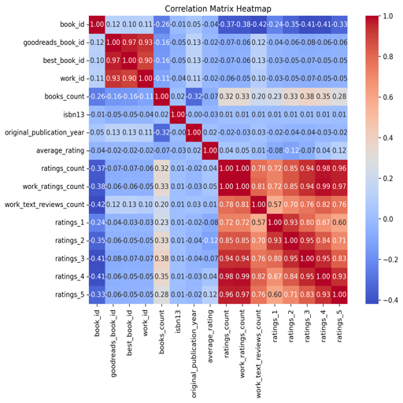

# Book Dataset Analysis Report

## Data Summary

The dataset consists of 10,000 entries across 23 attributes related to books, likely sourced from a platform such as Goodreads. Below is a summary of key aspects of this dataset:

- **Shape and Size:**
  - **Rows:** 10,000 (books)
  - **Columns:** 23 (attributes)

- **Missing Values:**
  - `isbn`: 700 missing
  - `isbn13`: 585 missing
  - `original_publication_year`: 21 missing
  - `original_title`: 585 missing
  - `language_code`: 1,084 missing

- **Data Types:**
  - Integer (`int64`): ID fields and counts (e.g., `book_id`, `ratings_count`)
  - Float (`float64`): Attributes like `average_rating` and `original_publication_year`
  - Object (string): IDs, authors, titles, and image URLs

### Head of Dataset:

| book_id | goodreads_book_id | best_book_id | work_id | books_count | isbn       | isbn13           | authors                              | original_publication_year | original_title                               | title                                                                         | language_code | average_rating | ratings_count | work_ratings_count | work_text_reviews_count | ratings_1 | ratings_2 | ratings_3 | ratings_4 | ratings_5 | image_url                                                            | small_image_url                                                      |
|---------|--------------------|---------------|---------|-------------|------------|-------------------|---------------------------------------|---------------------------|---------------------------------------------|------------------------------------------------------------------------------|----------------|-----------------|-----------------|---------------------|--------------------------|-----------|-----------|-----------|-----------|-----------|-----------------------------------------------------------------------|-----------------------------------------------------------------------|
| 1       | 2767052            | 2767052       | 2792775 | 272         | 439023483  | 9780439023480.0   | Suzanne Collins                       | 2008.0                    | The Hunger Games                            | The Hunger Games (The Hunger Games, #1)                                   | eng            | 4.34            | 4780653       | 4942365            | 155254                   | 66715     | 127936    | 560092    | 1481305   | 2706317   | [image](https://images.gr-assets.com/books/1447303603m/2767052.jpg) | [small image](https://images.gr-assets.com/books/1447303603s/2767052.jpg) |

## Insights

### 1. Missing Values
The dataset contains missing values in several key columns. The high amount of missing data in `isbn` and `isbn13` may hinder certain analyses like book identification. The significant missing values in the `language_code` column could impact language-based filtering and categorization efforts.

### 2. Attributes Assessment
- **Core Attributes** include identifiers for books, authors, average ratings, and ratings count.
- The dataset provides insights into the distribution of ratings through individual ratings fields (`ratings_1`, `ratings_2`, ..., `ratings_5`), facilitating analysis of user sentiment.
  
### 3. Correlation Insights
- Strong correlation between `ratings_count` and `work_ratings_count` (0.995) indicates that books with many ratings tend to have high `work_ratings_count`.
- Negative correlation between `ratings_count` and `books_count` suggests books with more copies available may receive fewer ratings, possibly due to saturation in the market.

### 4. Visualization
Below are charts based on the dataset:

### Conclusion
The dataset holds substantial potential for analyses such as sentiment analysis, trend analysis over years, and exploring author collaborations. However, addressing missing values and managing data types will be crucial for deriving robust insights from the dataset.