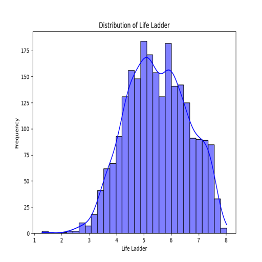
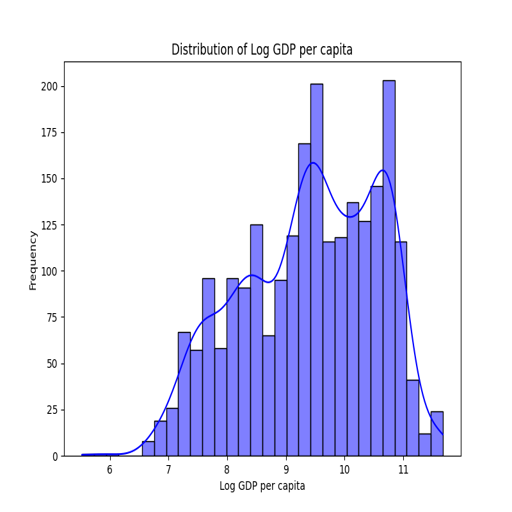
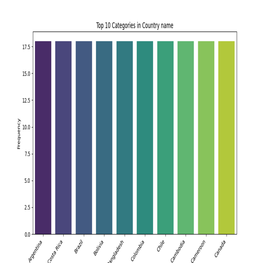

# Data Analysis Report

## Data Summary

- **Dataset Shape**: 
    - The dataset consists of **2363** rows and **11** columns.
  
- **Missing Values**:
    | Column                              | Missing Values |
    |-------------------------------------|----------------|
    | Country name                        | 0              |
    | Year                                | 0              |
    | Life Ladder                         | 0              |
    | Log GDP per capita                 | 28             |
    | Social support                      | 13             |
    | Healthy life expectancy at birth    | 63             |
    | Freedom to make life choices       | 36             |
    | Generosity                          | 81             |
    | Perceptions of corruption           | 125            |
    | Positive affect                     | 24             |
    | Negative affect                     | 16             |

- **Data Types**:
    - **Country name**: `object`
    - **Year**: `int64`
    - **Life Ladder**: `float64`
    - **Log GDP per capita**: `float64`
    - **Social support**: `float64`
    - **Healthy life expectancy at birth**: `float64`
    - **Freedom to make life choices**: `float64`
    - **Generosity**: `float64`
    - **Perceptions of corruption**: `float64`
    - **Positive affect**: `float64`
    - **Negative affect**: `float64`

- **Head of Data**: 
    | Country name | Year | Life Ladder | Log GDP per capita | Social support | Healthy life expectancy at birth | Freedom to make life choices | Generosity | Perceptions of corruption | Positive affect | Negative affect |
    |--------------|------|-------------|---------------------|----------------|----------------------------------|------------------------------|------------|--------------------------|-----------------|-----------------|
    | Afghanistan  | 2008 | 3.724       | 7.35                | 0.451          | 50.5                             | 0.718                        | 0.164      | 0.882                    | 0.414           | 0.258           |
    | Afghanistan  | 2009 | 4.402       | 7.509               | 0.552          | 50.8                             | 0.679                        | 0.187      | 0.85                     | 0.481           | 0.237           |
    | Afghanistan  | 2010 | 4.758       | 7.614               | 0.539          | 51.1                             | 0.6                          | 0.118      | 0.707                    | 0.517           | 0.275           |
    | Afghanistan  | 2011 | 3.832       | 7.581               | 0.521          | 51.4                             | 0.496                        | 0.16       | 0.731                    | 0.48            | 0.267           |
    | Afghanistan  | 2012 | 3.783       | 7.661               | 0.521          | 51.7                             | 0.531                        | 0.234      | 0.776                    | 0.614           | 0.268           |

- **Correlations**: 
    The correlation coefficients indicate linear relationships between variables:

    - **Life Ladder**:
      - Strong positive correlations:
          - **Log GDP per capita**: 0.78
          - **Social support**: 0.72
          - **Healthy life expectancy at birth**: 0.71
      - Negative correlation:
          - **Perceptions of corruption**: -0.43
  
    - **Log GDP per capita**:
      - Strong positive correlation:
          - **Healthy life expectancy at birth**: 0.82

### Insights

#### 1. Dataset Shape and Structure
- The dataset consists of various observations related to well-being across countries over several years.

#### 2. Missing Values
- The presence of missing values across several important fields, particularly in **Generosity** and **Perceptions of corruption**, raises concerns for thorough analyses.

#### 3. Data Types
- The data types are appropriate for analysis, which is conducive to quantitative analysis and modeling.

#### 4. Data Insights - Head of Data
- The dataset provides the opportunity to analyze trends over time within specific countries, with Afghanistan displaying values across multiple years.

#### 5. Correlations
- The analysis of correlations suggests significant relationships among various factors affecting quality of life. Focusing on improving GDP, social support, and health could enhance life satisfaction.

#### 6. Other Observations
- The connections between **Economic indicators** and **Well-being** reinforce the importance of socioeconomic policies aimed at enhancing life quality.

### Conclusion
The dataset is robust for analyzing relationships between various factors affecting well-being across countries. However, addressing missing values is critical for ensuring the reliability of statistical models and analyses. The identified correlations imply that any interventions should emphasize improving economic conditions, healthcare systems, and social networks to enhance overall life satisfaction.

