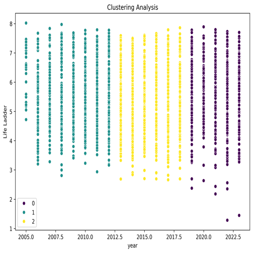

# Data Analysis Report

## Data Summary
The dataset summarizes various indicators related to well-being across different countries and years. Below are the key components of the dataset:

### 1. Shape of the Dataset
- **Shape**: `(2363, 11)` implies there are 2,363 rows (data entries) and 11 columns (variables). This is a relatively large dataset suitable for various analyses.

### 2. Missing Values
A summary of missing values indicates several columns have gaps:
- **Log GDP per capita**: 28 missing values
- **Social support**: 13 missing values
- **Healthy life expectancy at birth**: 63 missing values
- **Freedom to make life choices**: 36 missing values
- **Generosity**: 81 missing values
- **Perceptions of corruption**: 125 missing values
- **Positive affect**: 24 missing values
- **Negative affect**: 16 missing values

**Implications**:  
The presence of missing values, especially in key indicators like "Generosity" and "Perceptions of corruption," can affect the analysis. Careful handling of these missing values (e.g., imputation, exclusion) will be necessary depending on the analytical goals.

### 3. Data Types
The data types are summarized as follows:
- **Country name**: Object (string) 
- **year**: Integer 
- The remaining columns represent various dimensions of well-being and economic indicators, all as `float64`.

**Implications**:  
The integer `year` can facilitate time series analysis, while the floats allow for a range of numerical analyses, including correlation and regression analyses.

### 4. First Records (Head of the Dataset)
The head of the dataset provides the first five entries for Afghanistan across several variables:

| Country name | year | Life Ladder | Log GDP per capita | Social support | Healthy life expectancy at birth | Freedom to make life choices | Generosity | Perceptions of corruption | Positive affect | Negative affect |
|--------------|------|-------------|---------------------|----------------|-------------------------------|-----------------------------|------------|--------------------------|-----------------|-----------------|
| Afghanistan  | 2008 | 3.724       | 7.35                | 0.451          | 50.5                          | 0.718                       | 0.164      | 0.882                    | 0.414           | 0.258           |
| Afghanistan  | 2009 | 4.402       | 7.509               | 0.552          | 50.8                          | 0.679                       | 0.187      | 0.85                     | 0.481           | 0.237           |
| Afghanistan  | 2010 | 4.758       | 7.614               | 0.539          | 51.1                          | 0.6                         | 0.118      | 0.707                    | 0.517           | 0.275           |
| Afghanistan  | 2011 | 3.832       | 7.581               | 0.521          | 51.4                          | 0.496                       | 0.16       | 0.731                    | 0.48            | 0.267           |
| Afghanistan  | 2012 | 3.783       | 7.661               | 0.521          | 51.7                          | 0.531                       | 0.234      | 0.776                    | 0.614           | 0.268           |

**Implications**:  
The temporal dimension across years allows for longitudinal analysis, which could uncover trends in well-being in relation to economic factors over time.

### 5. Correlation Analysis
The correlation matrix provides vital insight into relationships among the different variables:

- **Strong Positive Correlations**:
  - **Life Ladder** with **Log GDP per capita** (0.78): Better economic performance is associated with higher life satisfaction.
  - **Life Ladder** with **Social support** (0.72): Social connections contribute positively to life satisfaction.
  - **Log GDP per capita** with **Healthy life expectancy** (0.82): Economically stronger nations tend to have better health outcomes.

- **Moderate Correlations**:
  - **Freedom to make life choices** positively correlates with **Life Ladder** (0.54) and **Positive affect** (0.58), indicating that the ability to make personal choices may boost overall life satisfaction and happiness.

- **Negative Correlations**:
  - **Perceptions of corruption** are notably negatively correlated with **Life Ladder** (-0.43) and positively with **Negative affect** (0.27), suggesting that higher corruption perceptions detrimentally influence life satisfaction and increase negative feelings.

**Implications**:  
These correlations can guide further analyses, suggesting pathways for interventions or policy changes to improve human well-being. The strong relationships with the “Life Ladder” highlight areas where improvement could yield meaningful benefits.

## Insights
This dataset contains valuable information about well-being and economic factors across different countries and years but requires careful handling of missing data. The strong correlations noted suggest fruitful avenues for further analysis, particularly in understanding the impact of economic factors and social support on life satisfaction. Overall, the dataset holds significant potential for insights relevant to social science, economics, and public policy domains.

## Visualizations
The following charts provide a visual overview of various aspects of the dataset:

*Correlation Matrix*

*Year Distribution*

*Life Ladder Distribution*

*Log GDP per Capita Distribution*

*Country Name Distribution*

*Clustering Analysis*

## Conclusion
The analysis of this dataset confirms significant relationships between socio-economic factors and life satisfaction indicators. Understanding these relationships can guide future initiatives aimed at improving quality of life in various regions. Further analysis could elucidate the underlying mechanisms and promote targeted interventions based on identified patterns in the data.