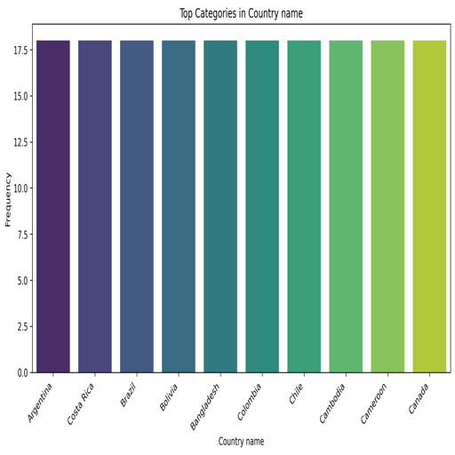

# Data Summary Report

## Dataset Overview
The analyzed dataset contains a total of 2,363 observations across 11 features, providing insights into various aspects of quality of life and social indicators across different countries and years.

### 1. Shape of the Dataset
- **Rows:** 2363  
- **Columns:** 11  
This structure suggests a potentially rich dataset capable of delivering significant insights into the studied variables.

### 2. Missing Values
Several variables in the dataset show instances of missing values:
- **Log GDP per capita**: 28 missing
- **Social support**: 13 missing
- **Healthy life expectancy at birth**: 63 missing
- **Freedom to make life choices**: 36 missing
- **Generosity**: 81 missing
- **Perceptions of corruption**: 125 missing
- **Positive affect**: 24 missing
- **Negative affect**: 16 missing
- Other columns, including `Country name` and `year`, have no missing values. Attention should be given to missing data, particularly in key variables, as this may influence overall analysis and outcomes.

### 3. Data Types
The dataset comprises:
- **Categorical Variable**: 
  - `Country name` (object type) 
- **Numerical Variables**: 
  - `year` (int64), 
  - Remaining columns as `float64`.

This mix of data types facilitates various analytical approaches, including group-by operations and correlation analyses.

### 4. Preview of Data
Here’s a snapshot of the first five rows for Afghanistan from 2008 to 2012:

| Country name | year | Life Ladder | Log GDP per capita | Social support | Healthy life expectancy at birth | Freedom to make life choices | Generosity | Perceptions of corruption | Positive affect | Negative affect |
|--------------|------|-------------|--------------------|----------------|---------------------------------|------------------------------|------------|--------------------------|-----------------|-----------------|
| Afghanistan  | 2008 | 3.724       | 7.35               | 0.451          | 50.5                            | 0.718                        | 0.164      | 0.882                    | 0.414           | 0.258           |
| Afghanistan  | 2009 | 4.402       | 7.509              | 0.552          | 50.8                            | 0.679                        | 0.187      | 0.85                     | 0.481           | 0.237           |
| Afghanistan  | 2010 | 4.758       | 7.614              | 0.539          | 51.1                            | 0.6                          | 0.118      | 0.707                    | 0.517           | 0.275           |
| Afghanistan  | 2011 | 3.832       | 7.581              | 0.521          | 51.4                            | 0.496                        | 0.16       | 0.731                    | 0.48            | 0.267           |
| Afghanistan  | 2012 | 3.783       | 7.661              | 0.521          | 51.7                            | 0.531                        | 0.234      | 0.776                    | 0.614           | 0.268           |

### 5. Correlations
The correlation matrix unearthed meaningful relationships between variables. Some key insights include:
- **Life Ladder** is highly correlated with:
  - **Log GDP per capita** (0.78)
  - **Social support** (0.72)
  - **Healthy life expectancy at birth** (0.71)
  
This indicates that increases in GDP and social support tend to correlate with improvements in life satisfaction.

- Conversely, **Life Ladder** shows negative correlations with:
  - **Perceptions of corruption** (-0.43)
  - **Negative affect** (-0.35)

This suggests that higher corruption and negative feelings are associated with lower life satisfaction.

- **Healthy life expectancy** also correlates strongly with GDP (0.82) and Life Ladder (0.71), emphasizing the links between economic conditions and health outcomes.

- **Freedom to make life choices** has a moderate positive correlation with all positive constructs, indicating its vital role in happiness and life satisfaction.

### 6. Overall Analysis
The dataset reveals opportunities for in-depth analyses concerning well-being, economic factors, health indicators, and social dynamics. The correlations indicate strong potential for further investigations, such as regression modeling, to determine predictors of life satisfaction.

The presence of missing values in critical variables requires careful handling to ensure accurate outcomes from analyses.

### 7. Future Data Considerations
Future analyses might explore:
- **Imputation of missing values** using statistical methods.
- **Time-series analyses** considering the temporal dimension.
- **Geospatial analyses** aimed at assessing regional differences if geographic data is made available.

This dataset has great potential for extensive exploratory and confirmatory data analysis, specifically regarding significant quality of life indicators across countries and years.

### Visualizations
The following charts illustrate key aspects of the dataset:

