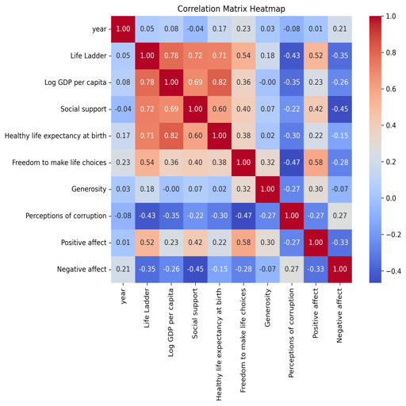
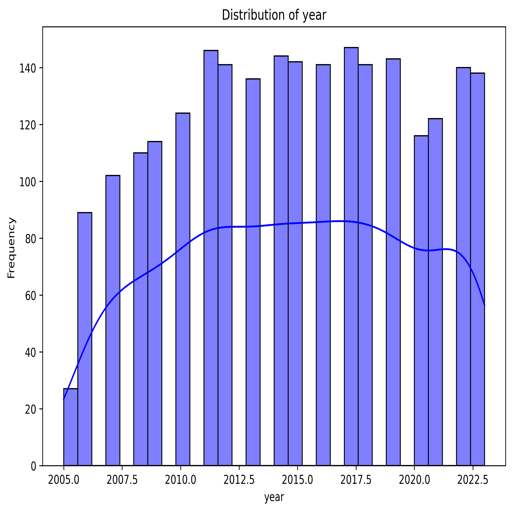

# Well-Being Dataset Analysis Report

## Data Summary

The dataset contains information on various factors that impact well-being across different countries and years. Below is a detailed summary of key characteristics of the dataset.

### 1. Dimensions of the Dataset
- **Shape**: The dataset has **2363 rows** and **11 columns**, indicating a substantive amount of observations available for analysis.

### 2. Missing Values
The dataset exhibits several columns with missing values:
- **Generosity**: 81 missing values
- **Perceptions of corruption**: 125 missing values
- **Healthy life expectancy at birth**: 63 missing values
- **Log GDP per capita**: 28 missing values
- **Social support**: 13 missing values
- Other columns do not show significant missing values.

It is essential to address these missing values in your analysis, considering the possible approaches include imputation, exclusion, or using caution in interpretation.

### 3. Data Types
The following data types are present in the dataset:
- Categorical:
  - **Country name**: `object`
- Numerical:
  - **year**: `int64`
  - Continuous variables (all in `float64`):
    - **Life Ladder**
    - **Log GDP per capita**
    - **Social support**
    - **Healthy life expectancy at birth**
    - **Freedom to make life choices**
    - **Generosity**
    - **Perceptions of corruption**
    - **Positive affect**
    - **Negative affect**

This setup allows for a range of statistical analyses, particularly regression analyses.

### 4. Sample Data
Here is a glimpse of the first five records sampled from the dataset:

| Country name | year | Life Ladder | Log GDP per capita | Social support | Healthy life expectancy at birth | Freedom to make life choices | Generosity | Perceptions of corruption | Positive affect | Negative affect |
|--------------|------|-------------|---------------------|----------------|---------------------------------|------------------------------|------------|---------------------------|----------------|-----------------|
| Afghanistan  | 2008 | 3.724       | 7.35                | 0.451          | 50.5                            | 0.718                        | 0.164      | 0.882                     | 0.414          | 0.258           |
| Afghanistan  | 2009 | 4.402       | 7.509               | 0.552          | 50.8                            | 0.679                        | 0.187      | 0.85                      | 0.481          | 0.237           |
| Afghanistan  | 2010 | 4.758       | 7.614               | 0.539          | 51.1                            | 0.6                          | 0.118      | 0.707                     | 0.517          | 0.275           |
| Afghanistan  | 2011 | 3.832       | 7.581               | 0.521          | 51.4                            | 0.496                        | 0.16       | 0.731                     | 0.48           | 0.267           |
| Afghanistan  | 2012 | 3.783       | 7.661               | 0.521          | 51.7                            | 0.531                        | 0.234      | 0.776                     | 0.614          | 0.268           |

### 5. Correlation Analysis
The correlation matrix highlights important interrelationships among variables:

- **Life Ladder** shows strong positive correlations with:
  - **Log GDP per capita**: 0.78
  - **Social support**: 0.72
- A significant negative correlation exists between:
  - **Perceptions of corruption** and **Life Ladder**: -0.43
- **Freedom to make life choices** correlates moderately with well-being: 0.54
- The dataset indicates that higher **Negative affect** is associated with lower **Life Ladder**: -0.35.

### 6. Actionable Insights
Given the correlations observed:
- Enhancing **Log GDP per capita**, improving **Social support**, and reducing **perceptions of corruption** could significantly elevate subjective well-being.
- Future analyses can explore predictive modeling, causal inference, or machine-learning applications to further leverage these insights.

### Conclusion
This dataset presents ample opportunities for developing a deeper understanding of the dynamics of well-being across countries and years. Addressing missing values while exploring inter-variable relationships will yield valuable insights into the socio-economic and health factors that influence quality of life. Future analyses could target predictive modeling or longitudinal explorations to assess changes over time.

### Visualizations
The following charts provide additional context to the analysis:

--- 

This report provides a comprehensive overview of the dataset while highlighting trends, insights, and directions for future research or policy implications.