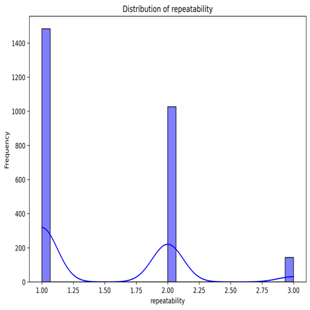

# Data Summary Report

## Dataset Overview
The dataset under review consists of **2652 rows and 8 columns**, where each row represents a unique media entry, likely movies, and the columns contain various attributes regarding these entries.

### Overview of Attributes
- **date**: The release date of the movie.
- **language**: Language in which the movie is available (e.g., Tamil, Telugu).
- **type**: Type of media, predominantly 'movie'.
- **title**: Name of the movie.
- **by**: Contributors associated with the movie such as directors or actors.
- **overall**: A rating indicating the overall quality of the movie.
- **quality**: A rating assessing the quality of the movie.
- **repeatability**: A rating indicating how likely the movie is to be watched again.

## Missing Values
The dataset contains several missing values:
- **'date'**: 99 entries are missing.
- **'by'**: 262 entries are missing.
- Other columns do not have any missing values.

The significant missing values in the 'by' column could potentially skew analysis, especially if those entries are relevant to overall trends or insights.

## Data Types
The dataset features a combination of categorical and numerical data types:
- **Categorical (object types)**: `date`, `language`, `type`, `title`, `by`
- **Numerical (int64 types)**: `overall`, `quality`, `repeatability`

This structure indicates that categorical attributes may need to be encoded for analysis or modeling.

## Preview of Data (Head)
Below are the first few records from the dataset:

| Date       | Language | Type  | Title        | By                           | Overall | Quality | Repeatability |
|------------|----------|-------|--------------|------------------------------|---------|---------|---------------|
| 15-Nov-24  | Tamil    | movie | Meiyazhagan  | Arvind Swamy, Karthi       | 4       | 5       | 1             |
| 10-Nov-24  | Tamil    | movie | Vettaiyan    | Rajnikanth, Fahad Fazil     | 2       | 2       | 1             |
| 09-Nov-24  | Tamil    | movie | Amaran       | Siva Karthikeyan, Sai Pallavi | 4       | 4       | 1             |
| 11-Oct-24  | Telugu   | movie | Kushi        | Vijay Devarakonda, Samantha  | 3       | 3       | 1             |
| 05-Oct-24  | Tamil    | movie | GOAT         | Vijay                        | 3       | 3       | 1             |

### Observations:
1. Dates are formatted in `day-month-year`.
2. Languages include **Tamil** and **Telugu**.
3. All entries are labeled as 'movie', with ratings provided for overall experience, quality, and repeatability.

## Correlations
The correlation matrix showcases the following relationships among numeric attributes:
- **Overall Rating**: 
  - Correlation with itself: **1.0**
  - Correlation with **Quality**: **0.83** (strong positive correlation)
  - Correlation with **Repeatability**: **0.51** (moderate correlation)
- **Quality Rating**:
  - Correlation with **Overall**: **0.83**
  - Correlation with **Repeatability**: **0.31** (weak correlation)

These correlations suggest that as the quality rating increases, the overall rating likely increases as well. Repeatability seems somewhat independent of quality, indicating that other factors might influence the likelihood of a movie being rewatched.

## Conclusion
The dataset provides a rich resource for analyzing the quality and enjoyment of movies in Tamil and Telugu. Attention should be given to the missing values in the 'date' and 'by' attributes, as they could be significant for certain analyses.

### Recommendations for Future Analysis:
- Investigate trends based on ratings over time.
- Compare ratings across various languages and types of media.
- Analyze the impact of specific contributors on ratings.

It is also recommended to address the missing values, especially for the 'by' attribute to improve the robustness of any predictive modeling or insights derived from the dataset.

## Visualizations
The following charts provide additional insights into the data:

This report summarizes key aspects of the dataset and serves as a basis for further exploration and analysis.