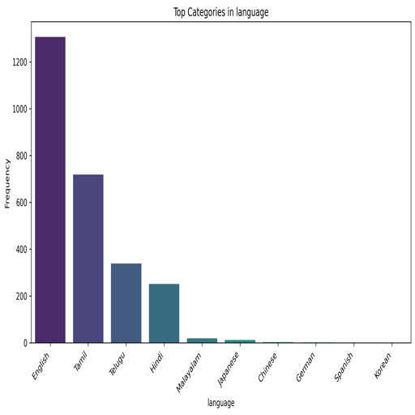

# Dataset Overview Report

## Data Summary
The dataset provides insights into movie ratings and contains the following characteristics:

- **Shape**: The dataset consists of **2652 rows** and **8 columns**.

### Missing Values
The distribution of missing values across columns is summarized as follows:

| Column      | Missing Values |
|-------------|----------------|
| date        | 99             |
| language    | 0              |
| type        | 0              |
| title       | 0              |
| by          | 262            |
| overall     | 0              |
| quality     | 0              |
| repeatability| 0             |

**Key Takeaway**: The most substantial missing values are in the **date** and **by** columns, which may impact analyses involving these fields.

### Data Types
The data types for each column are categorized as follows:

| Column        | Data Type |
|---------------|-----------|
| date          | object    |
| language      | object    |
| type          | object    |
| title         | object    |
| by            | object    |
| overall       | int64     |
| quality       | int64     |
| repeatability  | int64     |

**Observation**: Most fields contain categorical data, while the ratings are represented as numerical scores (int64).

### Sample Data (First Few Rows)
Here's a glimpse of the initial entries in the dataset:

| date        | language | type  | title         | by                          | overall | quality | repeatability |
|-------------|----------|-------|---------------|-----------------------------|---------|---------|---------------|
| 15-Nov-24   | Tamil    | movie | Meiyazhagan   | Arvind Swamy, Karthi       | 4       | 5       | 1             |
| 10-Nov-24   | Tamil    | movie | Vettaiyan     | Rajnikanth, Fahad Fazil    | 2       | 2       | 1             |
| 09-Nov-24   | Tamil    | movie | Amaran        | Siva Karthikeyan, Sai Pallavi | 4       | 4       | 1             |
| 11-Oct-24   | Telugu   | movie | Kushi         | Vijay Devarakonda, Samantha | 3       | 3       | 1             |
| 05-Oct-24   | Tamil    | movie | GOAT          | Vijay                       | 3       | 3       | 1             |

### Correlations
The correlation matrix reveals relationships between different variables:

| Variable         | overall | quality | repeatability |
|------------------|---------|---------|---------------|
| **overall**      | 1.0     | 0.8259  | 0.5126        |
| **quality**      | 0.8259  | 1.0     | 0.3121        |
| **repeatability**| 0.5126  | 0.3121  | 1.0           |

**Analysis Insight**: The strong positive correlation of **overall** ratings with **quality** (0.826) indicates that higher quality scores are likely to result in better overall ratings.

## Conclusion and Considerations
1. **Data Imputation**: Attention is required for the missing values in **date** and **by** columns. Strategies for imputation should be explored to maximize data usability.

2. **Date Formatting**: Transforming the **date** column into a standard datetime format will facilitate temporal analyses, such as trends in ratings over time.

3. **Predictive Modeling**: The correlation between **overall** and **quality** scores can be leveraged for predictive analytics to estimate overall ratings based on given quality scores.

4. **Analysis of Collaborators**: Exploring the missing data in the **by** column can illuminate potential trends regarding directors or cast members that are not represented, enhancing our analysis.

This summary sets the stage for more detailed exploratory data analysis and modeling, particularly focusing on understanding the dynamics of movie ratings.

---

## Visualizations
The following charts provide a visual representation of various dataset characteristics:

- Correlation Matrix:
  

- Overall Ratings Distribution:
  

- Quality Ratings Distribution:
  

- Repeatability Ratings Distribution:
  

- Movie Release Dates Frequency:
  

- Language Distribution:
  

- Movie Type Distribution:
  

--- 

This analysis serves as a robust foundation for future investigations into the dataset, allowing for a deeper understanding of factors influencing movie ratings and qualities.