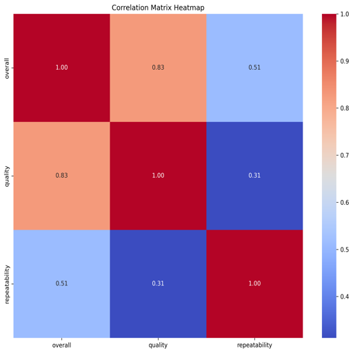
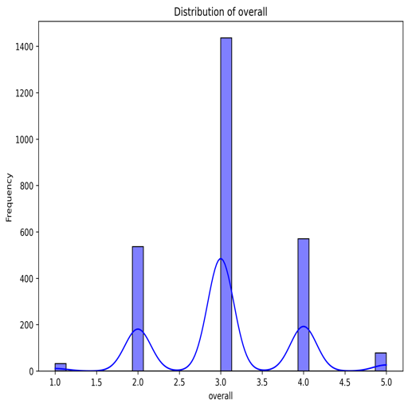
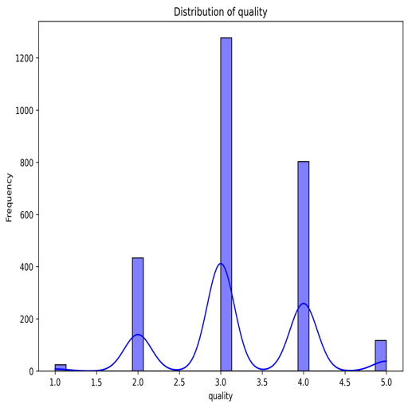

# Movie Dataset Analysis Report

## Data Summary

The dataset under consideration consists of records related to various movies, providing valuable insights into movie ratings and attributes. Below is a comprehensive summary and analysis:

### General Structure
- **Shape**: The dataset contains **2652 rows** and **8 columns**, indicating a sizable collection of movie-related records.
- **Column Descriptions**:
  - **date** (object): Represents the release date of the movies.
  - **language** (object): Denotes the language of the movies.
  - **type** (object): Specifies the type of content (all entries are "movie").
  - **title** (object): The title of the movies.
  - **by** (object): Credits the individuals involved, likely directors or producers.
  - **overall** (int64): Numerical rating (likely out of 5) representing overall quality.
  - **quality** (int64): Numerical score for quality, possibly representing a different aspect of appraisal.
  - **repeatability** (int64): This score could indicate the likelihood of a movie being watched again, rated on a scale (presumably also out of 5).

### Missing Values
- There are **99 missing values** in the **date** column, suggesting inconsistency in documenting the release dates.
- The **'by'** column has a significant number of missing values with **262 missing entries**, indicating a lack of creator information for many movies.
- All other columns (**language, type, title, overall, quality, repeatability**) do not have any missing entries, reflecting completeness in this dataset.

### Data Types
- The columns are primarily **categorical** (object type), except for **overall, quality, and repeatability**, which are **integer** types, indicating that further numerical analysis can be performed.

### Sample Records
- The head of the dataset showcases a uniformity in the types of movies included (all labeled as "movie").
- Titles include a variety from "Meiyazhagan" to "GOAT," indicating a range of films from a specific language or cultural context (Tamil and Telugu).
- Ratings for **overall** quality, **quality**, and **repeatability** show variability in a range from 1 to 5.

### Correlations
The correlation matrix provides insights into the relationships between the scores:
- **Overall Quality** positively correlates with **quality** (0.83) and has a moderate correlation with **repeatability** (0.51).
- The **quality** score exhibits a moderate correlation with the **repeatability** score (0.31), indicating that although they are related, they measure different aspects of movie engagement.
- The strong correlation between **overall** and **quality** suggests high overall satisfaction is linked with positive quality assessments.

## Conclusion and Recommendations
- The dataset is robust with a significant number of entries. However, the missing values present in the **date and by** fields require attention, as they diminish the contextual richness of the records.
- Further trending analyses can be conducted if the missing dates are populated, which could reveal temporal patterns in movie releases and ratings.
- Investigating viewer behavior through the repeatability score can yield beneficial insights into what contributes to high engagement, potentially influencing production and marketing strategies.

## Visualizations
To further understand the dataset's insights, several visualizations have been constructed:

### Correlation Matrix

### Overall Rating Distribution

### Quality Rating Distribution

### Repeatability Rating Distribution

### Movie Release Dates Distribution

### Movie Language Distribution

### Movie Type Distribution

### Clustering Analysis

### Time Series Analysis of Overall Ratings

### Network Analysis of Relationships

These visualizations provide valuable insights into various aspects of the dataset, allowing for a deeper understanding of movie ratings, trends, and viewer preferences.